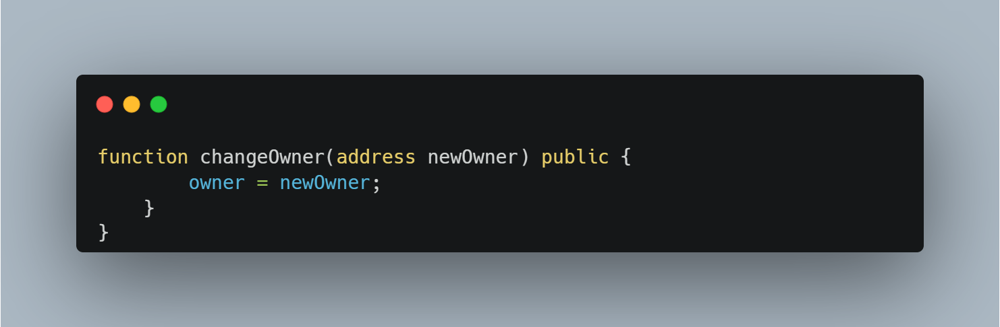
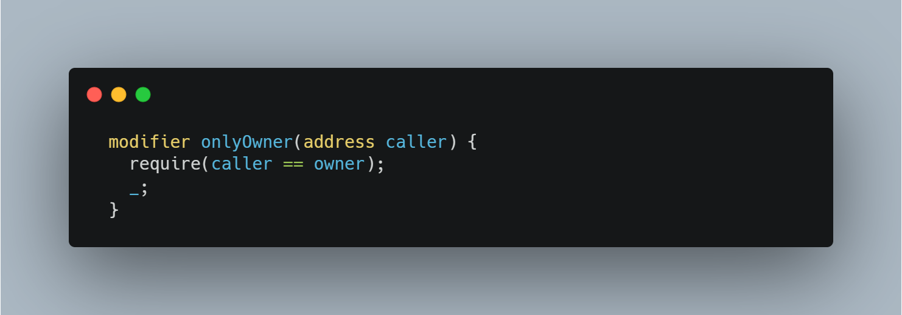

# Checking access control

> In Solidity, access control attacks may occur when a function that has important logic/restrictions is left without any access checks.

This could imply:

- Logic that changes the owner
- Authorization logic
- Using delegatecall to access functions in proxy contracts

An example of a function vulnerable to an access exploit is as follows:

We can clearly see that this function is left in a state where anyone can access it and change the owner, stealing the contract.

<h3> Preventative techniques

A solution would be to add a require statement inside the function:

> require(msg.sender == owner, "Only owner can perform this action");

In Solidity, there are the so called function modifiers that are useful when the same require logic has to be used within multiple functions. In the example above, this could look as follows:

In most cases, when the contract/function within a contract is directly connected to changing owner access/banking properties, finance, etc. most of the cases, an access control point is needed.

Be on the look out of whether a contract already contains some sort of an access system and see if all important functions implement their logic by using it.
