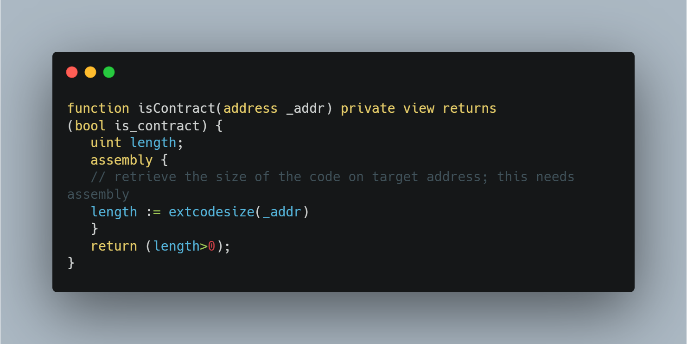

# Account Existence Check

> In Solidity, call, delegatecall and staticcall all use an address to access a function/send ether to an external account. 
>
> Their first return value for these functions is a boolean (whether or not it was succesfull), and the second return is the data, returned by the function call.

- Important note: Any 20 byte hash is considered a valid address. The EVM/Ethereum does not do any checks on whether a given sequence of bytes is a valid address. Therefore, this means that call(), delegatecall() and staticcall() will all return true, even for an address that doesn't have any account associated with it.

> Note: staticcall(), unlike call and delegatecall, does not change the state of a contract. This means that any function invocation that changes the state will be thrown and the transaction will revert.

<h3> Preventative measures

Addresses linked to an EOA can't be checked whether they exist or not (all addresses on Ethereum already "exist"). One measure that can be taken is asking the user to send a signed transaction on-chain to verify that there is indeed a private key assigned with the address. This can then be stored in a simple mapping, namely:

> mapping(address => bool) verifiedUser;

Addresses linked to a contract account, however, can be checked and validated whether the adddress has any bytecode associated with it. This can be seen with the example below:

What this snippet of code represents is a simple inline assembly section that checks whether the length of the bytecode of a given address is bigger than 0. This way, before sending a transaction, we can succesfully predict whether the address is a contract address or not.
