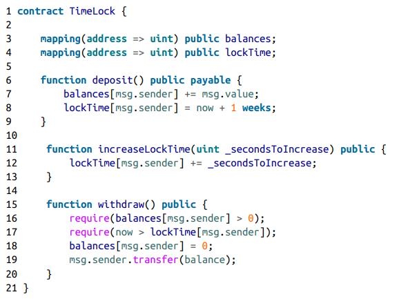
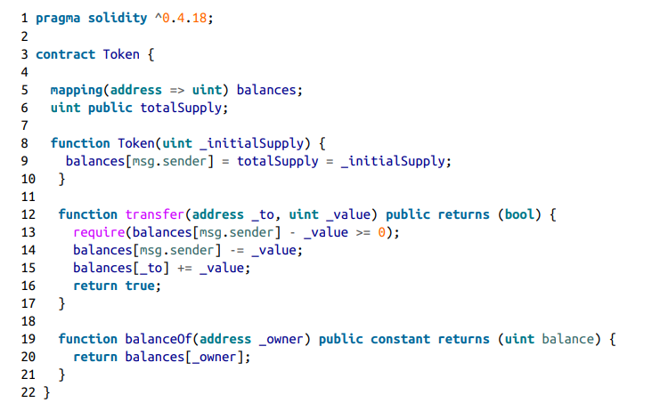

# Arithmetic under/overflow

> IMPORTANT: This issue has been resolved with Solidity compiler versions 0.8.0 and above. The EVM now reverts the transaction automatically on under/overflow

> Using any SafeMath libraries is now deprecated and gas inefficient

In solidity, integers can be stored and specified in various ways and sizes

For the sake of simplicity, we'll use uint8 to avoid long numbers.

uint8 means that the variable can store an unsigned integer of up to 8 bits.

> The maximum size of this integer is 255

What happens when the integer is at 255 and we increment it once more?

> This scenario is called an integer overflow. The size assigned is not enough and the integer "overflows" to 0.

Similar thing happens when our integer initialized at 0 and we decide to decrement

> This is called integer underflow. We take one out from an unsigned integer, making it "underflow" to the biggest number that it can hold (255 in this example)

We can see the overflow vulnerability firsthand in the following example given in the Mastering Ethereum book:

An attacker is able to reset the lockTime of this lock by figuring out exactly how much time is left and incrementing it to the point it overflows back to 0, making the timelock useless.

Similarly, here's an example for the underflow vulnerability:

The require statement on line 13 allows us to give a bigger value of what the balance[msg.sender] is. This makes it so that the integer underflows, allowing us to pass through and give us more value than we actually have.

<h2> Preventative techniques

SafeMath (or other alternative) libraries should be used. The one by OpenZeppelin provides logical checks before an arithmetic operation is performed, reverting the transaction on under/overflow.
