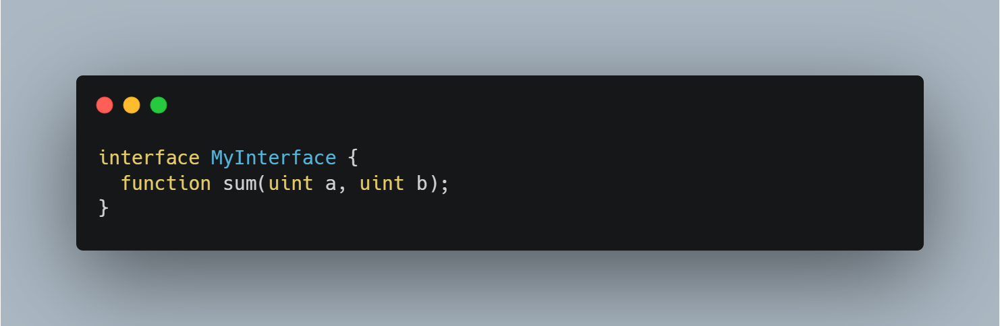
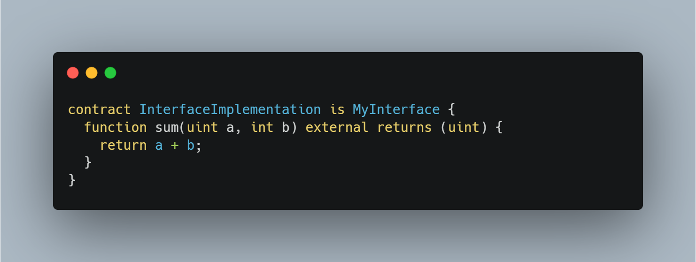

# Bad Interface DOS

> In Solidity, it is crucial to check the parameter types and names for implementations/interfaces.

Consider the following interface

This looks to be a standard interface with nothing abnormal (and it is).

We then have a simple implementation of the above shown interface:

As you can probably notice, the interface above defines two unsigned 256 bit integers as parameters, whereas the implementation specifies b to be an integer. 

> Calling the sum function would make the program error/revert, therefore making the function unusable.

<h3> Prevention measures

Always make sure that the implementation of an interface is the same as the definition. Especially check for the different parameter types.
