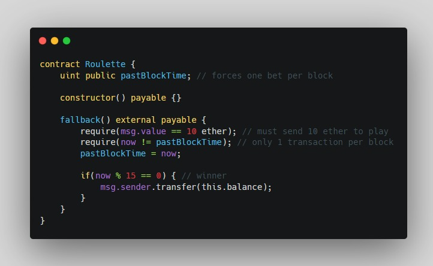

# Block Timestamp Manipulation

Miners have the ability to adjust timestamps slightly, which can prove to be dangerous if block timestamps are used incorrectly in smart contracts.

The vulnerability
-

This contract behaves like a simple lottery. One transaction per block can bet 10 ether for a chance to win the balance of the contract. The assumption here is that block.timestamp’s last two digits are uniformly distributed.

In this case if enough ether pools in the contract, a miner who solves a block is incentivized to choose a timestamp such that block.timestamp or now modulo 15 is 0. In doing so they may win the ether locked in this contract along with the block
reward. As there is only one person allowed to bet per block, this is also vulnerable to front-running attacks.

Preventive techniques
-

Block timestamps should not be used for entropy or generating random numbers.

me-sensitive logic is sometimes required; e.g., for unlocking contracts (time-locking), completing an ICO after a few weeks, or enforcing expiry dates.

This can be unnecessary if contracts aren’t particularly concerned with miner manipulations of the block timestamp, but it is something to be aware of when developing contracts.