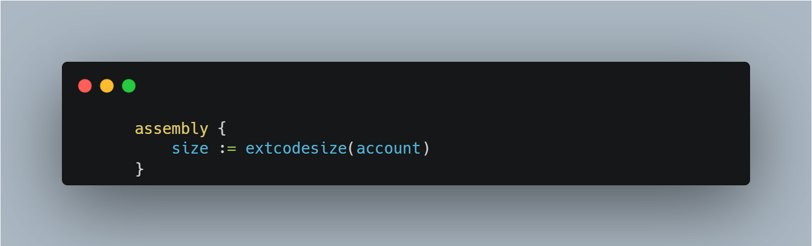

# Bypassing contract check

> In Solidity, with the help of the EXTCODESIZE opcode and inline assembly, you are able to check whether at a given address, the bytecode length is > or < than 0

However, this has to be used with great care, as there are security vulnerabilities connected with its use.

Let's assume that you have a contract that you want only EOA's to interact with. With the above code snippet, you could write a simple modifier and check whether or not the length of the bytecode of the address (msg.sender) is > 0. This way, we could make it so that contract accounts can't execute the function, right?

Unfortunately, this can be bypassed. 

The way that the EXTCODESIZE works is that if  a contract references the vulnerable contract and calls the "protected" function, the check will pass and the contract will be able to call the function. This is because upon initialization in the constructor, EXTCODESIZE returns a 0.

<h3> Preventative measures

Avoid relying on the above shown inline assembly to distinguish between EOA/Contract accounts. There are a few cases where it might make sense, but it should generally be avoided or used with caution.
