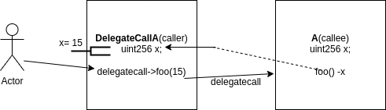

# Delegatecall

> Delegatecall and call are two ways to do external message calls to contracts

> Delegatecall and call function almost identically, but delegatecall preserves the context of the caller.

This can be explained with the following diagram:

In a nutshell, EOA that calls contract_a, which in hand calls contract_b with delegate call is basically like saying: 

> contract_a is allowing contract_b to change its state variables. Furthermore, when the delegatecall reaches contract_b, the msg.sender and origin is the EOA (preserved context).

From this, we can derive two important issues:

> 1. Delegatecall preserves context
> 2. Storage layout must be the same in order to properly use delegatecall

Delegatecall is usually used within the context of libraries to modularize code. When used incorrectly, it opens up a large security issue.
