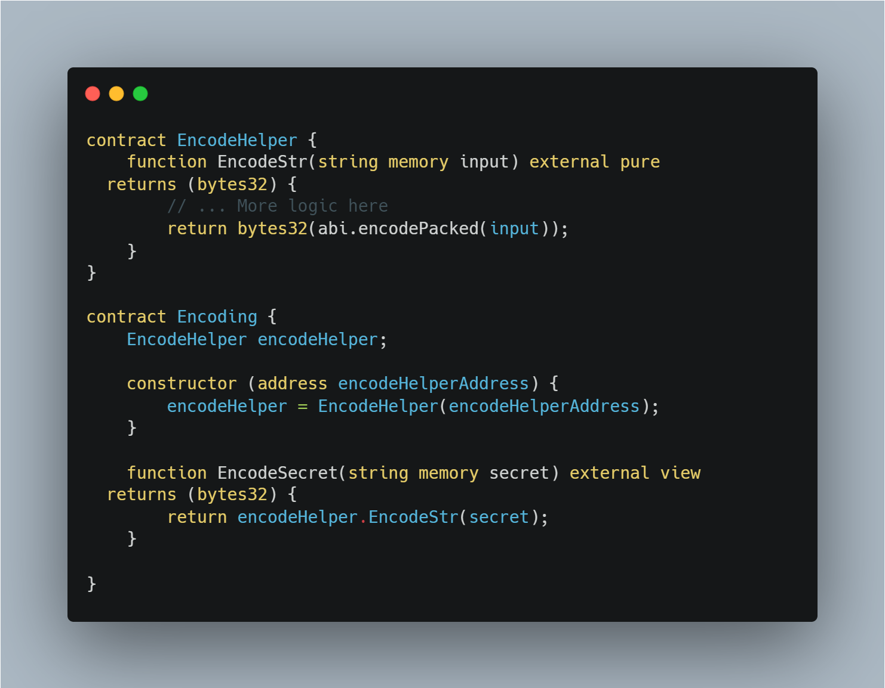
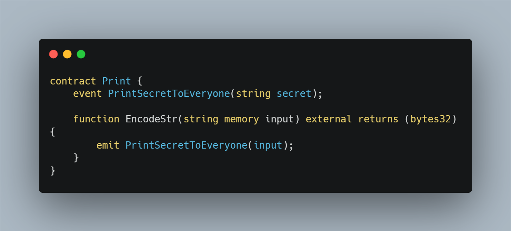

# External contract referencing

> Ethereum is a global decentralized singleton computing machine. This means that on the network, there are millions of executable objects (smart contracts), many of which are well known and used by many other contracts. (take ERC20 implementations for example, SafeMath libraries, etc);
>
> A lot of contracts reference and use other external contracts as a result. This can be problematic, as malicious code can be masked easily by attackers.

In Solidity, any address can be casted as a contract. This means that a user might look like he's referencing one contract, but under the hood masking malicious functionality.

The following example shows this clearly:

On a first glance, this looks like a normal contract that uses the EncodeHelper to return the abi encoded bytes32 of a string.

Taking a closer look at the constructor of the Encoding contract, however, we see that the contract can mask malicious code.

Because of how Solidity and the EVM work, any address is a valid address to a contract. This is not checked anywhere/stored on the blockchain.

> This means that the EncodeHelper, referenced in the Encoding contract doesn't have to necessarily point to the above defined EncodeHelper contract. This is especially apparent when we look that the deployer of the Encoding contract can easily pass a different address to a contract that has the same function definitions as the above EncodeHelper.

To demonstrate this better, we can define the following exploit contract that the user can mask.

As we can see, the EncodeStr is practically the same definition here, but emits an event with the secret alongside with it.

<h2> Preventative measures

> When referencing external contracts, you should try to use the "new" keyword whenever possible. This way, by deploying one contract, you ensure that the contract that is being deployed doesn't mask any hidden functionality.

> Another way is to make the address of the contract that's being referenced within a constant state variable and use that to create the reference to the external contract.
