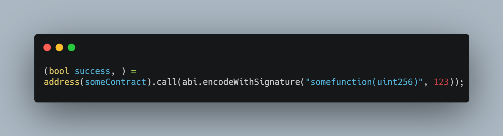
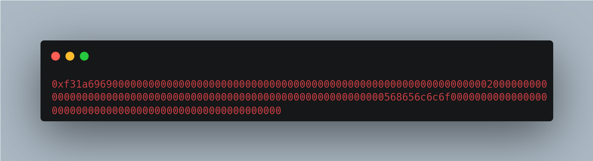

# Function selector abuse

> The standard way of making an external function call to another contract in Solidity is to pass the function selector (name of the function), as well as the arguments (parameters) followed by it.

A call might look like: 

As seen above, the address of the external contract is used to call someFunction() where the only parameter/argument is a uint256.

The call is also encoded and digitally signed (with the private key and ECDSA).

In place, the ABI will convert the following snippet into the bytecode as shown below:

The first 4 bytes represent the function selector (name) with the data types of the arguments for that function. In the above example, this will be someFunction(uint256) which will be represented as 0xf31a6969 in bytecode.

If the function selector and type is modifiable by the public, an attacker can brute force a certain selector until he hits a function that executes some sensitive logic. This is exactly what happened with the Poly network hack (multi-chain), where a hacker bruteforced an external function and managed to become the "owner" of the Ethereum part of Poly. 

610 million in USD, BTC and ether were lost.

[https://research.kudelskisecurity.com/2021/08/12/the-poly-network-hack-explained/](https://research.kudelskisecurity.com/2021/08/12/the-poly-network-hack-explained/)
