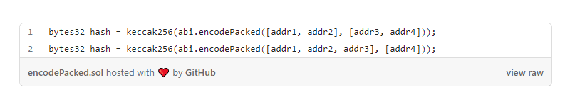

# Hash collision parameters

> Hash collision is when two different inputs result in the same output (the same hash)

This can be quite problematic, as one of the most important properties of hash functions is that they stay unique with every different input. 

The vulnerability comes from how abi.encodePacked() manages parameters

*Credit Kaden Zipfel on Medium*

These two hashes will be the exact same, even though the parameters are different.

<h4> Preventative measures

When `abi.encodePacked()` is used, it is crucial to make sure that the same hash/signature could not be reproduced using different parameters. To fix this, users should not be allowed to modify parameters inside encodePacked. Alternativelly, abi.encode() can be used.
