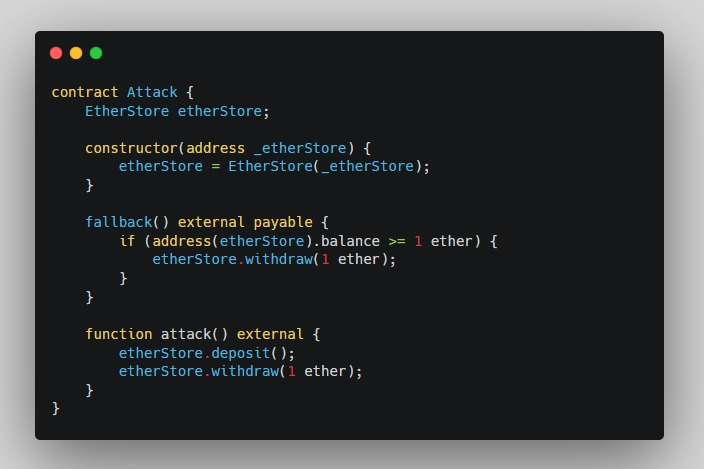
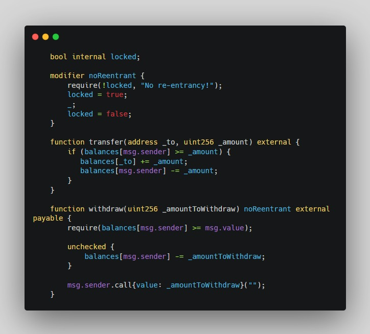
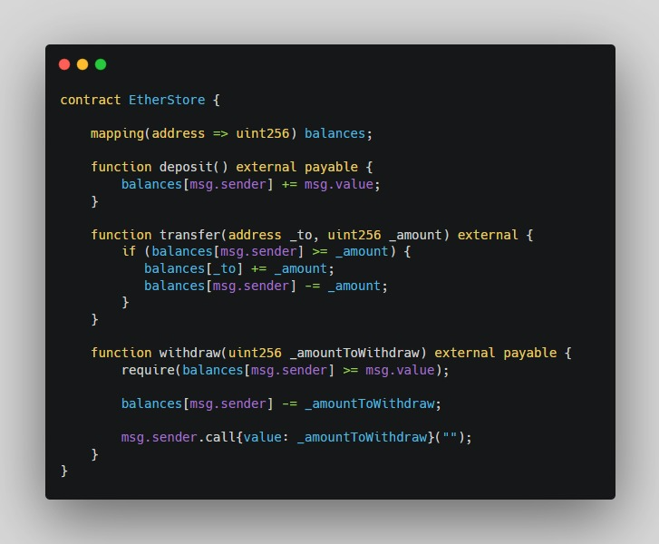
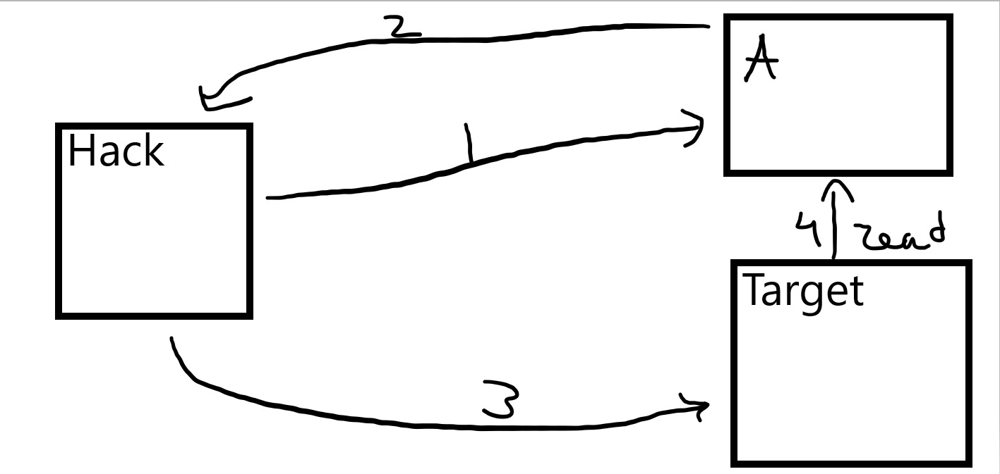

# Reentrancy Attacks

Reentrancy Attack repeatedly withdraws funds from a smart contract, let's call it Vulnerable Contract and transfers them to other smart contract until the funds of the Vulnerable Contract the  have been exhausted.

Now let's go through some examples:

This is a typical example of contract that is vulnerable to single function reentrancy attack

Do you see that

    balances[msg.sender] -= _amountToWithdraw;

is executed after

    msg.sender.call{value: _amountToWithdraw}("");
Where is the problem here you may ask?
msg.sender.call will invoke the fallback function in the contract that invoke the withdraw function.

If some contract has the fallback function and in this function implements again the withdraw function of EtherStore contract, a devastating recursion will occur and will drain the EtherStore's balance.

Here is an example of particular attack:

When the attacker calls the attack function in the Attack contract:

1. Deposits 1 ether
2. Immediately withdraw the ether
3. In the fallback function in the Attack contract again invokes the withdraw function
4. Repeat that process until the balance of the EtherStore is equal >= 1 ether.

Prevention
-

Always use *checks-effects-interactions pattern* or use mutex mechanism but keep in mind that using such mechanism, you have to be aware that such solution doesn't prevent Cross function reentrancy.

Cross function reentrancy
-
Preventing only the state variables in one function that make external calls isn't enough because an attacker is able to perform reentrancy attack on two different functions that share the same state.
This is cross function reentrancy.

As you can see here the withdraw function is implementing noReentrant modifier but that doesn't mean that it isn't vulnerable to reentrancy attacks

Prevention
-

Always use *checks-effects-interactions pattern*
and place state variables manipulation

Here is an example:

Cross-Contract reentrancy
-

Cross-Contract reentrancy is very similar to cross-function reentrancy, except the fact that the functions in a particular contract may not be subject to reentrancy attack but the state variables used in them are updated insecurely in other contracts.

Read Only reentrancy
-

Read-only reentrancy occurs where a view function is called and reentered into during the execution of another function that modifies the state of that contract.

>This could potentially lead to stale data since what is read in memory during function invocation and what is recorded in storage has yet to be finalized and may be out of sync.

Let's see an example:

Firstly, the Hack contract will call A contract.
Then contract A will call back in contract Hack.

> At this moment the first call (Hack->A) hasn't yet finished.

And while it is not finished Hack contract is calling Target contract.

Then, the Target contract will read some state from contract A.

After reading from contract A, the step 3 finishes, then the execution of step 2 and lastly the first execution(step) also finishes.

