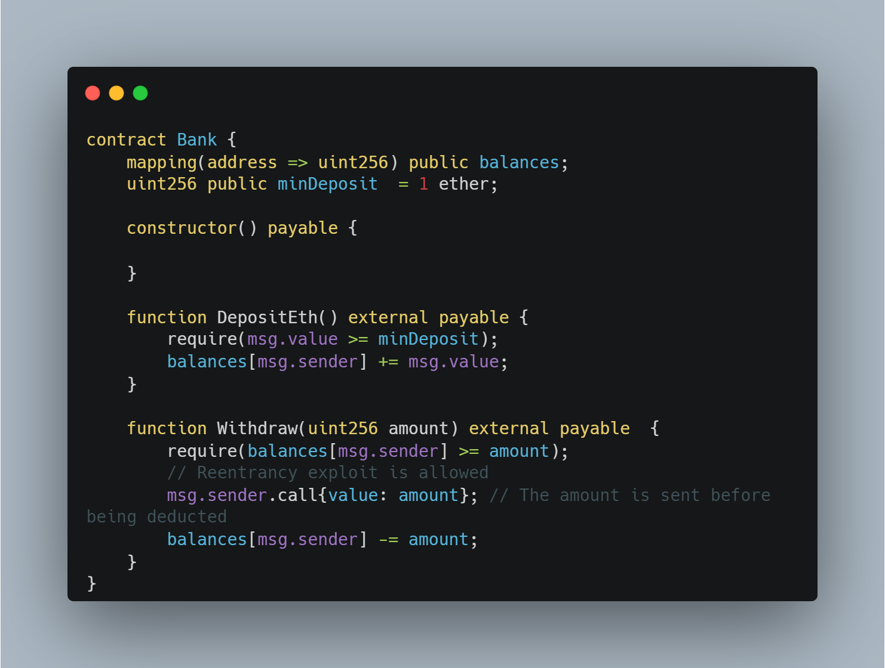
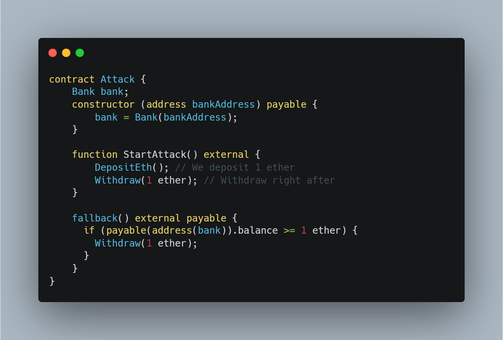

# Reentrancy

> Reentrancy is when an attacker is able to achieve race condition and repeat an action (that he's not supposed to) multiple times consequently.

The easiest way to spot a contract that's vulnerable to re-entrancy is by looking for important logic that occurs after the following functions are used:

- call()
- send()

> Reentrancy mainly occurs when a contract sends ether to an unknown contract. 

> The reason behind why this vulnerability is possible when using the above functions is because of how Solidity and the EVM handle payments from one contract to another.

In Solidity, for a contract to receive ether through the functions above, it must have:

> 1) A payable function
> 2) A payable fallback function

Lets imagine the following snippet:

We can see that in the Withdraw(uint256) function, the amount to withdraw is first sent to the caller of the contract. Finally, the balance for that msg.sender is decremented.

This is problematic, as an attacker can create a contract with malicious code within a fallback function that re-enters the Withdraw function.

> The way this works is because of the state balance of the caller being decremented only after the amount is sent.
>
> The attacker "re-enters" the withdraw function and steals the ether from the contract. His balance never gets decremented.
>
> The following snippet demonstrates how an attack might look like:

We graph the reference of the Bank contract and initialize it in the constructor.

We then have the StartAttack() function which does the following things:

- Deposit 1 ether
- Withdraw 1 ether right after

What happens when those two are exectued consequently is that in the Bank contract, the balance of the attacker becomes 1 ether. Right after that, he requests a withdrawal and passes the requirement for him to have that amount. 

> Ether is then sent to the attack contract throught the payable fallback function, where it checks whether the balance of the contract is bigger than 1 ether. If that condition passes, the attacker is able to withdraw as much ether as there is in the contract by calling Withdraw() once again. 

This is possible because of race condition. The Bank contract is never able to decrement the attacker's balance and he drains all of the ether stored.

<h2> Preventative techniques

> Always use transfer() in place of call() and send() when possible. It only sends 2300 gas which is enough to send the Ether, but not enough to run more functions subsequentially.

> The actual sending of ether/transfer logic should always be done after the state variables have been changed

> Another way to prevent reentrancy is by using a mutex that locks the function until the transaction is done, preventing an attacker from re-entering

Other resources to look into for re-entrancy fallback functions is:

>  Cross-function reentrancy
>
>  Cross-contract reentrancy
