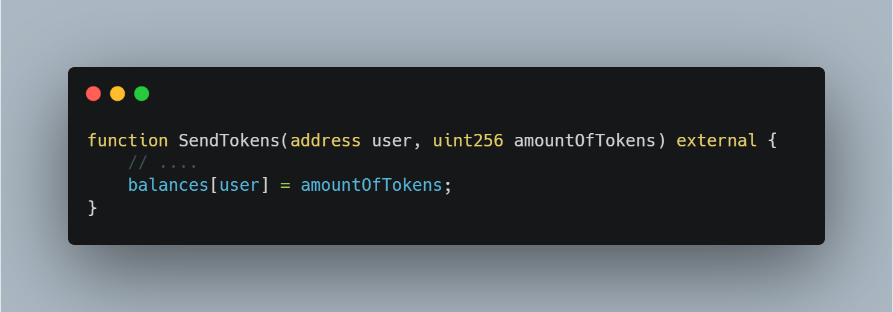

# Short Address / Parameter attack

> This attack does not originate from within Solidity itself, but instead comes externally of the blockchain.

<h5> Context

A transaction on the Ethereum blockchain can be either a value send (EOA to EOA), contract deployment (compiled bytecode, sent to the 0x0) address or a function call

> The way that a function call is done is as follows:
>
> The EVM leaves 4 bytes for the function identifier.
>
> After that, for every parameter for that function, a fixed amount of bytes are set aside (this is all deterministic and already pre-configured by the EVM).

Lets say we have the following function in a contract:

This looks like a perfectly safe function to use, but it can be the subject of a parameter/short address attack.

However, because of how the EVM compiles the parameters in their pre-fixed byte size, a user can provide malicious input.

The pre-fixed bytes assigned for an address parameter is 32 bytes. Same goes for uint => 32 bytes.

If a user decides to give a hex of 31 bytes, the EVM deals with this by adding two zeros for every byte thats missing. In the function above, this can be exploited because of what the hex looks like:

{4 bytes for function reference}{32 bytes for the address}{32 bytes for the uint}

Let's say the user provides 31 bytes for his address(instead of 32) and a uint of 100 (for the sending of 100 tokens).

The EVM would compile tis as follows:

> a9059cbb000000000000000000000000deaddeaddea
> ddeaddeaddeaddeaddeaddeadde00000000000000
> 00000000000000000000000000000000056bc75e2d6310000000

If you notice, there are 2 more zeros than there should be at the end. This means that the user will send 25600 tokens, instead of the original 100.

<h3> Preventative measures

> All parameters should be checked and validated. This is done by the web3 provider used to build the external side of the application. Providers like web3.js handle this automatically.

> Ordering of variables can prevent (mitigate) such attacks.

While this attack is very rare and no major exploit has been done using it, the best advice is for developers to stick with reliable and up to date technology. Using outdated clients might lead to someone being able to perform the exploit and send a misconfigured transaciton, forcing the EVM to add zero's and achieve unexpected issues.
