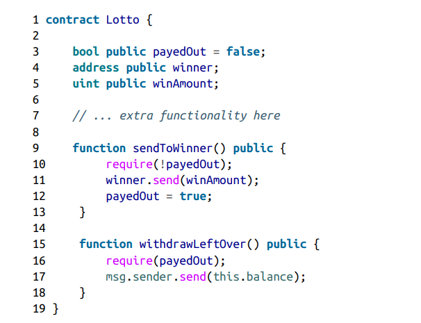

# Unchecked CALL Return Values

> The most secure and exploit-proof way to send ether from one address to another is by using the transfer() function. This is because it only designates 2300 gas, meaning that there isn't enough left for reentrancy/other function executions.

The security issue of call and send comes from the fact that the EVM does not revert the transaction when something fails. 

> Both call() and send() functions return booleans. This means that if left unchecked, any underlying logic will pass, as the transaction will not revert

As given by the Mastering Ethereum book, we have the following example:

As you can see, on line 11, the send() function is used under the condition that the person has not payed out yet. 

The security issue here comes from the fact that the user, regardless of wheter or not he is the winner of the lotto can use the sendToWinner() function and then withdrawLeftOver() to take all of the balance of the contract.

<h3> Preventative techniques

To prevent this issue, the call and send functions return values should always be checked for success or not.
