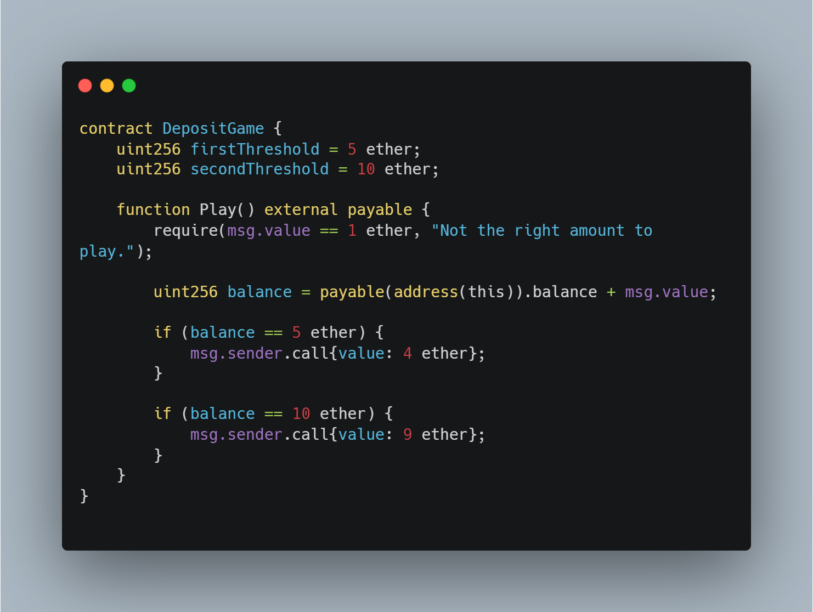

# Unexpected ether

> Unexpected ether is when a contract is designed to not receive ether/only specific ether entrypoints, but ether is sent to it anyways.
>
> This is typically done by using solidity's inbuilt selfdestruct(address) which deletes the bytecode of a contract and sends the balance to the address specified.

One common misconception that developers have about Solidity is that a contract must have a payable function/fallback in order to receive ether.

This is not true (and is a security pitfall), as contracts can receive ether with the above mentioned selfdestruct(), despite whether the vulnerable contract has anything payable.

> IMPORTANT NOTE: The SELFDESTRUCT OPcode will eventually be deprecated and unusable

We can look at the following example for a simple contract, vulnerable to the unexpected ether attack:

We can see that the contract has strict equality checks, which is mistake number one.

Furthermore, the balance variable is directly derived from the contract's balance. This is a big security issue, as the balance of the contract itself can be artificially modified.

We define the following attack:

It is a simple contract that has a payable constructor (to insert ether when deploying) and a function that selfdestructs the contract and sends its balance to the vulnerable DepositGame.

We can see that in the vulnerable contract, there are exact value checks for 5 eth and 10 eth. An attacker is able to inject 0.1 ether into the contract, making the checks obsolete, as they can never get executed.

> Another way to load ether unexpectedly into a contract is by pre-loading the address it will be deployed on.
>
> Addresses are deterministic in the Ethereum blockchain (they are the hash of the public address of the transaction maker + the transaction nonce). Therefore, any hacker is able to predict and bruteforce an address, preloading it with ether and rendering any balance specific logic useless.

<h2> Preventative measures

> Contract logic should never rely directly on the contract balance itself, as it is artificially modifiable.

> A state variable can be introduced that keeps track of the balance. This state variable will prevent an attack, as it can only be updated from within a payable function and not with selfdestruct()
