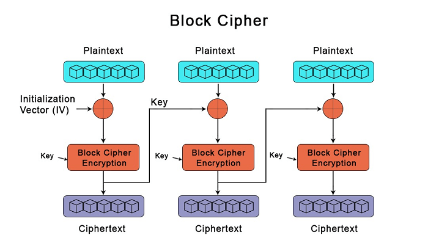
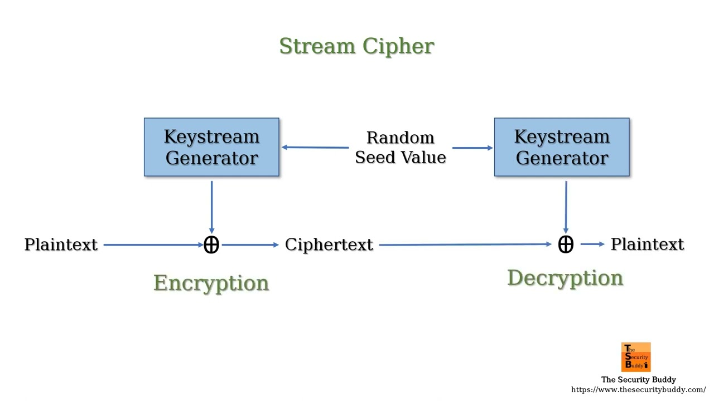
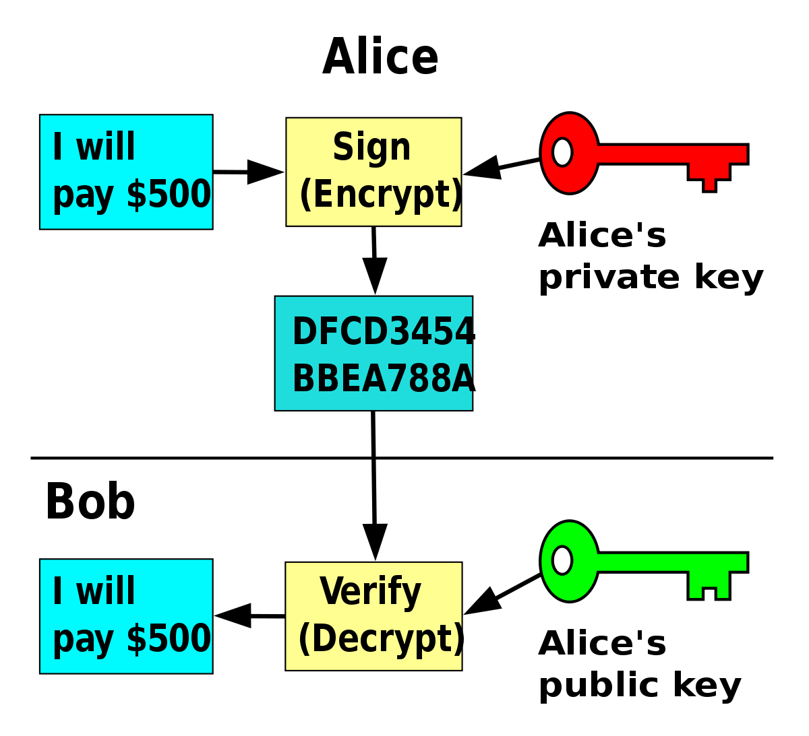
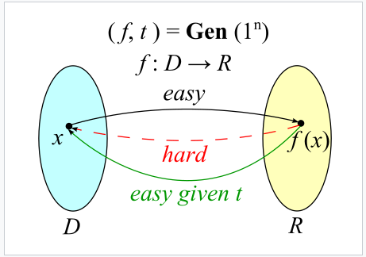
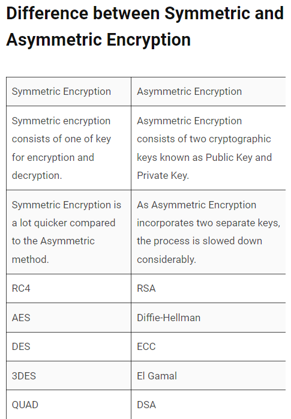

# Assymetric vs symmetric cryptography

<h3> Symmetric encryption

> ❗  Symmetric key encryption is a type of encryption where there is only secret key that is being passed around together with the encrypted data ❗

> Symmetric algorithms are also known as secret key algorithms

Imagine you want to send a message to someone, but you do not want to reveal the contents of that message. By using symmetric encryption, the data is "encrypted" with a certain algorithm which can then be decrypted using only a special private key.

- The secret key, used by the communicating entities may be in any form - number, string, or both.
- ❗ They have to be achieved using an RNG (Random number generator). For banking-grade encryption or similar, an RNG must be used that is up to industry standards, for example FIPS 140-2

<h4> What is a cipher?

A cipher is a type of algorithm that takes in a plaintext input and a key and encrypts it. The way that ciphers work can vary a lot (some can be very complex and some may be quite simple.) The key does not have to be a set of characters or numbers, but it can be a set of actions that must happen.

>  ❗ For example, we imagine a message, "Attack the king" and a key "Rotate every letter by 13 places to the right"

<h4> Types of symmetric algorithms

>  `<b> Block algorithms (block ciphers)`

❗ Block ciphers (as the name suggests) are encryption algorithms where the input data is encrypted in blocks, rather than bit by bit. Usually, the size of the blocks is fixed, but most standards are 64 bits to 128 bits.

> Some of the most important and popular symmetric cipher algorithms are DES and AES

> ❗ DES: Data encryption standard. The blocks are of size 64 bits and the keys are of size 56 bits. This is no longer a standard since they are too easy to decrypt and easy to brute-force

> ❗ AES: Advanced encryption standard
>
> Blocks of 128 bits are encrypted/decrypted and keys of sizes 128 bits, 192 or 256 bits.

Block ciphers require an IV (initialization vector) that is added to the input to increase the keyspace of the cipher and make it more difficult to decode. The IV is derived from an RNG, which is combined with the first block's text to ensure all of the other blocks result in ciphertext that isn't the same.

`<b> Stream algorithms (stream ciphers)`

❗ Stream ciphers are encryption algorithms, where unlike the block ciphers, they work by encrypting bit by bit

> The key for stream ciphers can be combined together with the data, desired to be encrypted. 

> Some examples are Chacha20 or RC4 (too weak to use)

<h4> Where is symmetric encryption used?

Unlike asymmetric encryption, symmetric is much faster. It is also much more efficient and less CPU use.

> ❗ Since symmetric encryption is generally faster and more efficient, it is used to encrypt lots of bulk data - suck as database encryption

> Symmetric encryption is used in hashing, random number generation and payment applications/validations

<h4> Assymetric encryption

> ❗ Assymetric encryption (also known as public key encryption) is a type of encryption where there are two keys available. One of those keys is public and the other one is private

Private keys can be generated in varying ways. In ethereum, private keys are very long, randomly generated numbers. Then, an assymetric algorithm (namely ECDSA) is used to encrypt the private key and derive a public key. 

> ❗ Assymetric encryption is hundreds of times slower than symmetric encryption. The reason why assymetric encryption is often referred as "more safe" is that there is no key that is constantly being transfered with every message/transaction.

> The keys are mathematically connected
>
>>  You can derive a public key from a private key but not the other way around
>>

> ❗ Important note as example: The trapdoor function

<h4> Differences between the two types of encryption

