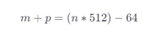
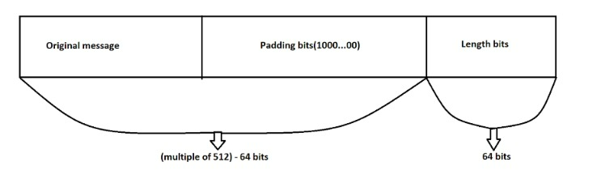
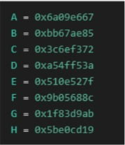
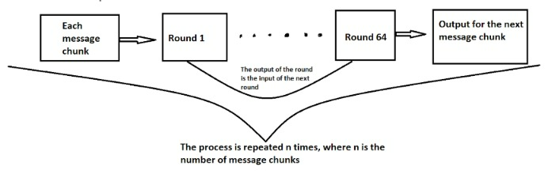
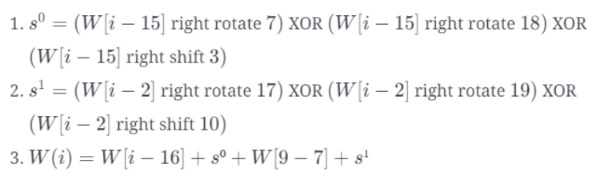
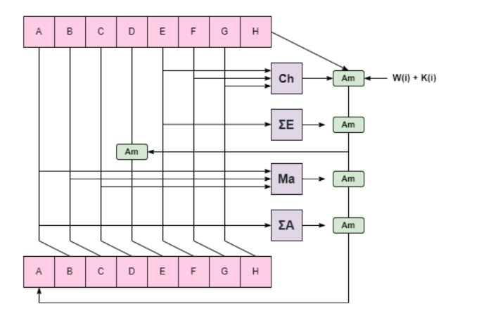
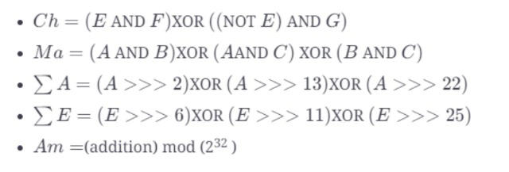

What are the different steps in SHA-256?
Step one: Appending bits
The first step involves preprocessing the input message to make it compatible with the hash function. It can be divided into two main substeps:
Padding bits
The total length of our message must be a multiple of 512. In this step, we append bits to the end of our message such that the final length of the message must be 64 bits less than a multiple of 512.
The formula below depicts this step: 

Where m = length of our message, p = length of the padding, n = is a constant
The first bit that we append is 1 followed by all 0 bits.
Length bits
Next, we take the modulus of the original message with 2^32 to get 64 bits of data. Appending this to the padded message makes our processed message and exact multiple of 512

Step two: Buffer initialization
Before we begin carrying out computations on the message, we need to initialize some buffer values. The default eight buffer values are shown below. These are hard-coded constants representing hash values.

Moreover, we have to initialize an array containing 64 constants, denoted by k.

Step three: Compression function
Now that we have our message and buffers ready, we can begin computation.
Recall that our processed message is n*512 bits long.
This will be divided into n chunks of 512 bits. Each of these chunks is then put trough 64 rounds of operations and the output from each round serves as the next input

Moreover, each input consists of two constants - K(i) and W(i). K(i) is preinitialized and W(i) is initialized by breaking each of the 512 bit chunks into 16 sunblock of 32 bits each for the first 16 rounds. After that, W(i) must be calculated at each subsequent round

Each round carries out the following set of computations:

The output from each round is fed as input to the next round until the last chunk is reached. The output from the last block will be the final hash digest of length 256 bits.
