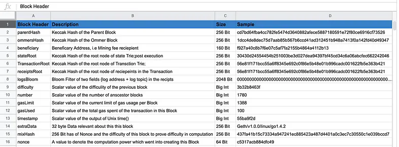
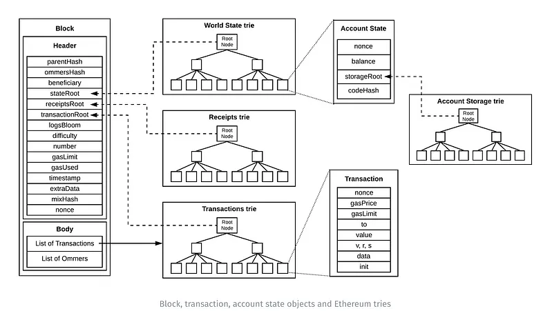

# Block Headers

> Block Headers are all of the fields that are contained within a block. There are 15 distinct fields, as seen below.

A block on the Ethereum blockchain comprises of block headers and transactions. The state, transactions and the receipt header fields have pointers to the root hash.

> A diagram explaining the connection between block headers and the 3 trie's

