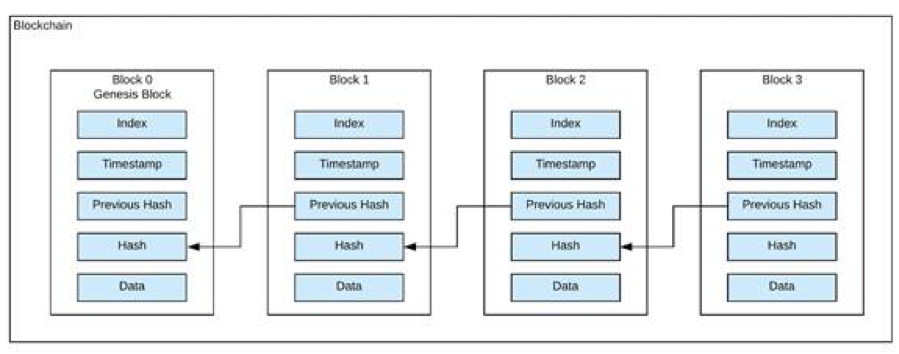

# What is ethereum?

Ethereum is a deterministic, but unbounded state machine that consists of a global singleton state and a virual machine that applies changes to that state.

Ethereum uses ether as the currency for transactions and execution costs.

<h4>Key components of a blockchain:</h4>

>  P2P Network that connects participants and execute transactions and blocks of verified transactions. 
>
> This is based on a standard "gossip protocol"

> Messages (Transactions) that represent state changes

> Chain of blocks (hence the name blockchain) that are connected to eachother. Each block keeps the previous's block 's hash, hence why they are connected in a chain-like matter. It also serves as a journal for all of the transactions that have happened.

> Consensus algorithm that decentralizes the control by making sure the participants cooperate with the consensus rules

> Incentive: proof-of-work costs & block rewards. This funds the ecosystem and makes sure that the state machine can be used in an open environment.

<h4>How does Ethereum deal with DoS attacks and overuse of resources?</h4>

> Ethereum has a metering resources, namely gas. As the EVM of Ethereum executes a smart contract, it calculates the costs of each instruction

> When a transaction triggers the execution of a smart contract, it must include the upper limit of what that smart contract may consume in resources.

> Gas can only be bought with ether and is only used for transactions. Anything thats left after a transaction is returned to the user
