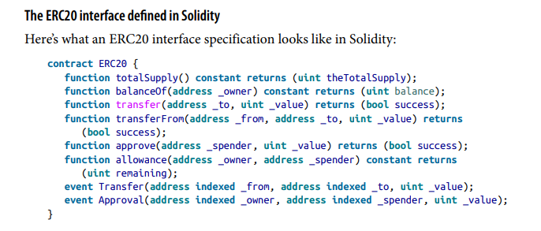
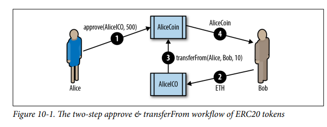
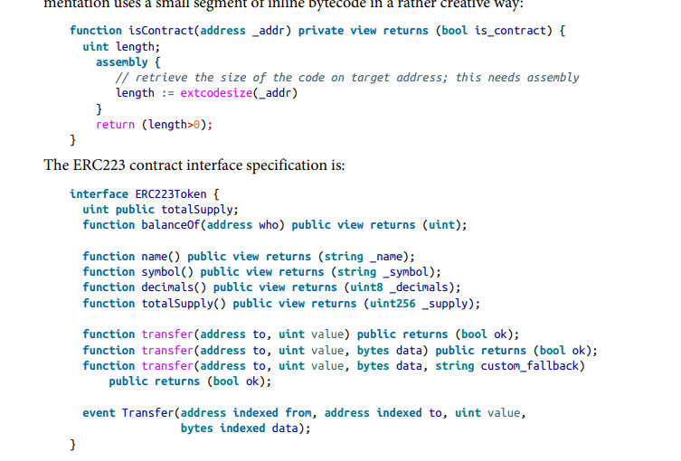

# Tokens

> Tokens can be under any form:
>
> - Identity
> - Cars
> - Paintings
> - Currency
>   etc.

> Tokens can also be fungible and non-fungible:
>
> Fungible: Something is fungible when each one of "it" is exactly the same as any of the other ones available. This means that if you trade a token for another, you would not be able to tell the difference.

> Non-fungible: Something is non-fungible when they are not interchangeable with eachother. One painting is not equal to a different painting, even if they are from the same artist.

<h4> Tokens and intrinsicality

> Intrinsic: from within

Tokens can be intrinsic, aka directly from within the Ethereum blockchain. This means that they are governed by the consensus rules of the blockchain and are decentralized. To buy a token from a person, you buy it directly from them, no intermediary. If you hold a key to a certain token, it is "truly" yours, without the worry of it being seized or taken by a 3rd party.

> Extrinsic: external

Some tokens are extrinsic. This could mean that they represent something of value from outside the blockchain. This could be a car, a painting, a voting pass, etc. These types of tokens are not governed by the consensus rules of the Ethereum blockchain. It is not guaranteed that the exchange/use of such a token is bound to happen.

<h4> Utility vs equity

Tokens can represent both the access to some service or a share/part of something.

> For example, a utility token might be a voting pass to some election. By holding such a token, you have the right to cast a vote.
>
> On the other hand, an equity token can be represented as a share/part of something/some company/etc.

Most startups nowadays (especially in the crypto world) introduce somekind of equity token as a measure of getting the initial sales or interest of the public. 

> Utility tokens, on the other hand, can be a trap if used incorrectly. The crypto world is already quite niche, so introducing a utility token that represents some small function in a decentralized application (example) can be counted as applying a second filter. Not a lot of people might find it useful or interesting enough for that token to really see its purpose shine.

<h4> Tokens on Ethereum

The first cryptocurrency token can be deemed to be Bitcoin. Furthermore, in its early adaptations, Ethereum has introduced tokens as an important utility function from within the blockchain.

Tokens are not like ethers. When exchanging ether, a transaction is created on the blockchain that shows the exact transaction details, logs and the amount of ether that has been exchanged.

> Tokens, on the other hand, are not controlled by the protocol layer. Instead, they are on the smart contract layer. This means that a contract can be directly responsible for issuing, distributing, trading all of the tokens without the Ethereum blockchain ever directly knowing of this.

> Because of this, it is best to follow a standard when implementing some kind of token.

<h4> ERC20 Token Standard

> ERC - Ethereum request for comments

The ERC20 is one of the first token standards to immerge from within the Ethereum blockchain. 

> ❗ The ERC20 standard is for fungible tokens. This means that any ERC20 token can be exchanged for another ERC20 token without the two having a difference/unique properties.

> ❗ The ERC20 introduces a standard interface that each implementation of the token must use.

The ERC20 required functions are as follows:

> totalSupply: returns the total units of this token that already exist. ERC20 tokens can have a limited supply or variable.

> balanceOf: returns the token balance of a given address.

> transfer: given an address and amount, defines a function for sending that amount to the given address to another. All transfers happen by substracting and adding the balances.

> transferFrom: Given a sender, recipient and amount, transfers tokens from one account to another. Used in combination with approve.

> approve: Given a recipient address and amount, authorizes that address to execute several transactions up to that amount, from the account who issued the approval.

> allowance: Given an owner address and a spender address, returns the remaining amount that the spender is approved to withdraw from the owner.

> Transfer: an event, triggered upon a succesful transfer (transfer or transferFrom)

> Approval: Event logged upon a succesful call to approve.

Furthermore, there are 3 other optional functions that can be defined for the ERC20 standard: 

> name: returns a human readable name ("US Dollars"), representing the token.

> symbol: returns the human readable symble ("USD"), representing the token.

> decimals: Returns the number of decimals used to divide token amounts. For example, if
> decimals is 2, then the token amount is divided by 100 to get its user
> representation.

<h4> ERC20 Token interface in Solidity

<h4> ERC20 data structures

Upon the examination of any implementation of ERC20, you will notice the two following data structures:

> mapping(address => uint256) balances;
>
> This represents all of the balances, mapped by the addresses of the owner of that given balance.
>
> ❗ Each transaction is a deduction or addition to this data structure

> mapping(address => mapping(address => uint256)) public allowed;
>
> This mapping represents the allowances. This means that any owner of tokens can delegate authority to a spender to use a specific amount of tokens. It is a mapping of the owner of the tokens, mapped to a spender address and the amount that is allowed to be spent. 

<h4> ERC20 workflows - transfer | approve and transferFrom

> ERC20 has two types of transfer workflows. 

> The first one is a simple transfer from one account to another.
>
> It is a single transaction, straight forward workflow using the transfer() workflow. This is what is used to send from one wallet to another and majority of the transactions happen with transfer()

> ❗ transfer workflow: Alice wants to send Bob 10 tokens. Her wallet sends a transaction to the token contract address, which then calls the transfer(bob.address, amount), deducting 10 tokens from Alice's balance and adding 10 to Bob's.
>
> Further, a Transfer even is issued out succesfully. ❗

The second workflow is a two-transactions workflow that uses approve, followed by transfer from. 

> *Snippet from book*
>
> 

> The workflow can be explained with the following example.
>
> Alice has created a coin and issued out a supply of 10,000 tokens. She wants to keep 9000, but give out 1000 as an ICO (initial coin offering). Alice then sends an approve transaction to her AlliceCoin contract, allowing the AlliceICO contract to distribute 1000 of her tokens. (under the hood, this is applied the balances and allowance data structures). 
>
> Bob then sends a 5 ether to the AlliceICO. The alliceICO then calls the transferFrom function in the AlliceCoin contract, which in hand finally sends the ether from allice's balance into bob's balance.

<h4> ERC20 Implementations

It is possible to create an implementation of an ERC20 compatible token in about 30 lines of code, most implementations are a lot more complex. 

There are 2 implementations mentioned in the EIP-20 standard: 

> Consensys EIP20: Simple and easy to read implementation of an ERC20 compatible token

> OpenZeppelin StandardToken
>
> ERC-20 compatible implementation with additional security precautions. It is formed on the basis of OpenZeppelin libraries that implement more complex ERC20 compatible tokens with fundraising caps, auctions, vesting schedules and other features.

<h4> Issues with ERC20 Tokens

> One of the main problems with the ERC20 Tokens is that they are hard to distinguish between a normal cryptocurrency and tokens.

> In a token transfer, no transaction is actually made (and logged) that shows how many tokens/what type of token was just transfered. Therefore, a token balance can only be tracked if a wallet is pointed to track such a token balance. 

Furthermore, a lot of the ERC20 tokens are like email spam. Random contracts that find your public address add it to their token contract and give you a bunch of random tokens.

> One of the main problems is the following example:
>
> You want to exchange some bitcoin for some tokens. You go on an exchange platform and decide to buy 1000 COOL tokens for 1 bitcoin. You recieve the tokens (the balance is updated) and you decide that you want to send them to someone. 
>
> You suddenly realize that you've just bought an ERC20 token, which is not a cryptocurrency and is stationed on the Ethereum blockchain. To actually send tokens, you need to now buy ethers to pay for such a transfer of tokens.

> Another issue is sending tokens to a contractthat does not support holding such a token. Over 2.5 million $ are "stuck" in such contracts, never to be withdrawn as they do not support the management of ERC20 Tokens
>
> ❗ EOA's do not support tokens. You should NOT send tokens to an address that is an EOA.

<h4> ERC223: Proposed token contract interface standard

The ERC223's idea of dealing with the above mentioned issue is to detect whether an address is actually the one of a contract. Furthermore, ERC223 requires that a fallback function named `<b>tokenFallback` is implemented. If the destination address is a contract, but the fallback function is not implemented, then the transaction fails.

> How does the ERC223 detect whether an address is a contract? Inline bytecode.
>
> a function isContract is defined that takes in the address of a contract and returns a boolean. With the use of assembly, the code size is retrieved of the address. If the size is > 0, then the address is a contract.

> ERC223 is not widely used and there are debates whether this should be dealt at the user interface level rather than the smart contract level.

<h4> ERC777

<h4> ERC721: Non-fungible Token (deed) standard

So far, everything mentioned above has been about fungible tokens. ERC721 is different, as it represents a standard to implement a non-fungible token. 

> Non fungible tokens are something that is unique by itself than different tokens. This could mean a car, a house, etc. They can even be things such as legal documents (not yet used), deeds, digital items, etc.

> NFT's, such as the ones that implement the ERC721 standard, can be distunguished with the help of a unique identifier of 256 bits.

> One notable difference can be understood by looking at the following mapping:
>
> mapping (uint 256 => address) private deedOwner;

<h4> Using Token Standards

> Token standards are meant to make the creation and management/use of tokens more global. 
>
> If you implement the ERC20 standard for your token, you can automatically assume that a lot of already existing wallets that have support for ERC20 tokens can open up a gateway for users to purchase/exchange your tokens

> Token standards and implementations are well tested. They have been exploited, hacked and gone through a lot of updates, so rolling out your own system is not recommended, unless you want to innovate in some way.

Token standards can be limiting when it comes to some of the functionality, but they suit most of the user cases of applications.

Furthermore, using an already existing implementation (such as OpenZeppelin's implementation of the ERC20 standard) you can assume that the tokens will be secure and probably won't be compromised.
