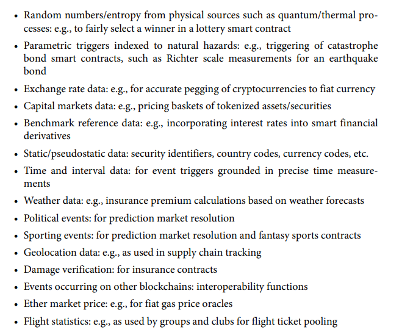
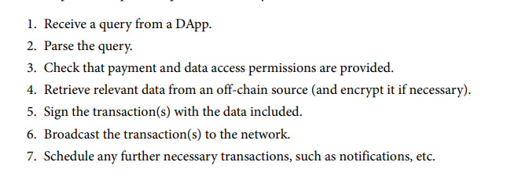

# Chapter 11 - Oracles

<h4> What are oracles?

> In the Ethereum blockchain, the term Oracle refers to an extrinsic data source. 

Oracles are needed for a lot of things, such as the information of football matches, the randomness needed for a gambling/lottery game or any other outside of Ethereum data.

> The problem is that such data sources must be "trustless", meaning they do not have to be first trusted for their data to be used. 

Some of the data that can only be obtained with oracles in the Ethereum blockhain is:

<h4> Oracle design patterns

1) Collect data from off-chain
2) Transfer data onto chain with a signed message
3) Make data available by putting it into a smart contract's storage

> The three ways that an oracle can be set up are request-response, publish-subscribe and immediate-read

<h5> Immediate read

> Data query is baed on "just-in-time"

> This type of oracle usually stores the information required in storage and a search can then be made with a specific request: "Is this person over 18?","What is this person's address?". 

> Such a request might happen once and never again.

An example might be a university to set up an oracle for all of the certificates and rewards achieved by past students. Such data might not want to be exposed to everyone, therefore it is noted that oracle data might be hashed to keep its privacy.

> A solid way to do this would be with Merkle trees with salts and only storing the root hash in the smart contract's storage for efficiency.

<h4> Publish subscribe

Contracts can "subscribe" to the publisher oracle and once new data, relevant to a subscriber is available, he can be notified.

> A contract can either poll the oracle to check whether the latest information has changed or they can listen for updates when they occur.

Polling is considered innefficient for outside of the blockchain, but not really from within. A polled call is simply a call to a synced Ethereum client. 

> NOTE: If polling is done by the smart contract itself, there could be a lot of gas spenditure.

<h4> Request-response

The request-response category is the most complex one. This is where the off-chain data required is too large to be stored.

> The request response process can usually be categorized in some straight forward steps:
>
> 1. The process starts by a transaction from an EOA to some contract that has a link to an oracle.
> 2. The smart contract calls a function from the oracle that in hand, retrieves the data from a secure off-chain provider. The oracle might also request expenditure or data access costs/rights.
> 3. Finally, the resulting data is signed by the oracle owner and retrieved.

Data can come from sensors, humans or the internet. Therefore, we can say that oracles can be human, software or hardware.

> To note: The request-response is usually seen in server to client communication. This, however, does not make it appropriate in all cases in the context of Ethereum. Given that the data changes infrequently (not often), a publisher subscriber or even immediate read might be more suitable.

<h4> Data Authentication

> Given that we assume that the source of data is trustworthy and authoritative, a question still remains: how do we trust such a mechanism?
>
> The main reason behind such a question might be that data can be tampered with. This can be especially dangerous if future elections/lottery/etc are done on chain.

There are two main ways of data authentication:

> Authenticity proofs

> Trusted execution environments (TEEs)

Authenticitiy proofs are cryptographic guardantees that the data has not been tampered with. Based on a lot of techniques (digitally signed proofs), they shift the trust from the data carrier to the attestor. 

> This way, by verifying the data on chain, we can prevent tampered data before using it.
