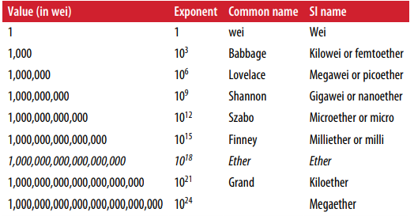

# Ethereum basics

<h4>Ether currency units</h4>

> Ether is subdivided into the smallest unit possible, called wei. 
>
> One ether is 1 * 10^18 or 1,000,000,000,000,000,000 wei

> Ethereum is NOT the currency:
>
> Ethereum is the system and ether is the currency of said system.

> Metamask is overall the most recommended wallet for beginners.
>
> Jaxx is another option where simplicity is key

<h5>Ether is much more than just a regular currency. It is meant to be mainly used for the execution of smart contracts </h5>

<h2>Extenally owned accounts (EOAs) and Contracts

Metamask is an externally owned account. It is an account that has a private key - meaning there's access to private funds or contracts. 

> The other type of account is a contract account. It does not have a private key and is controlled by the logic within the smart contract code.

> Contracts have addresses just like EOAs. They can send and receive ether. Furthermore, transactions can trigger different functionality within a smart contract.

<h4> Creating a smart contract </h4>

Registering a smart contract usually means executing a special transaction with a destination of `<b>0x0000000000000000000000000000000000000000</b>`

This is called the zero address and it tells the Ethereum blockchain that a contract is being registered.
