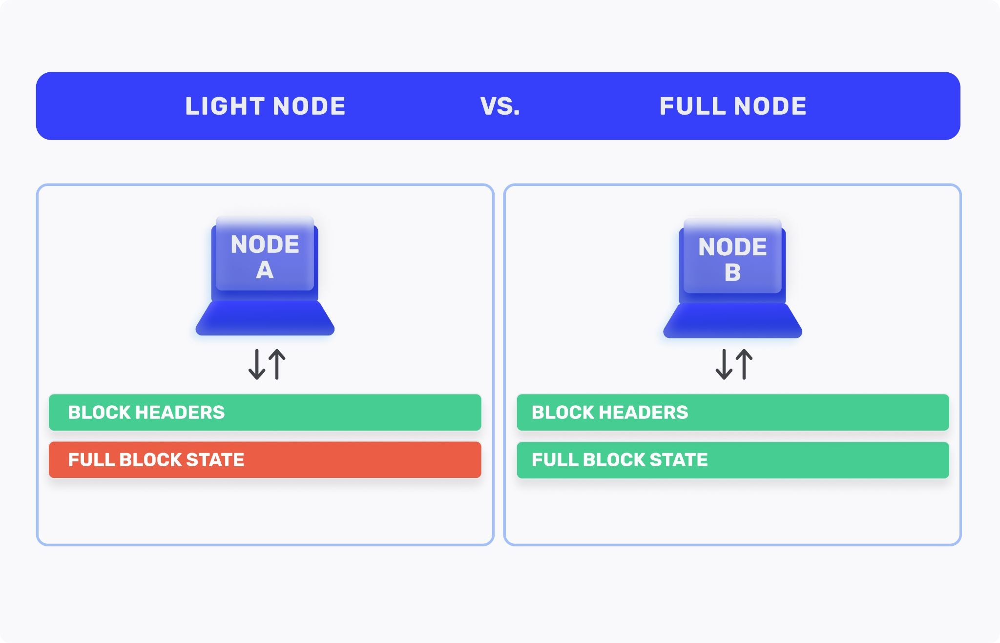

# Ethereum clients

Ethereum client is a software application that implements the ethereum specification and communicates with other clients with the peer-to-peer network, mentioned in Chapter 2.

> Clients written in different languages can work together if they all follow the same set of rules and reference specifications.

The most common implementations of Ethereum protocol are

> • Parity, written in Rust
> • Geth, written in Go
> • cpp-ethereum, written in C++
> • pyethereum, written in Python
> • Mantis, written in Scala
> • Harmony, written in Java

The most popular ones are Parity and Geth.

In order to run a node, a copy of the entire blockchain must be downloaded. Currently, the blockchain data is around 800-1000 GB and is rapidly increasing every day.

<h4> Local blockchain simulation </h4>

> Instead of getting the full-sized blockchain data, testnets can be used. The issue is, however, that real money can't be used. Furthermore, not all problems that may occur in the real blockchain can be tested (security i.e).

An alternative to this is to launch a single-instance private blockchain. 

> Ganache (testrpc) is one of the most popular blockchain simulations

> Advantages of Ganache

- You mine the first block
- No other users except you
- No other contracts except the ones you deploy
- Almost no data required

> Disadvantages

- No other users - meaning no competition for mining transactions
- Everything must be deployed yourself, including existing libraries that may occur on a public blockchain

In order to not have to sync with the public blockchain, an alternative is using `<b>a remote ethereum client</b>`

Remote ethereum clients usually provide the following:

> • Manage private keys and Ethereum addresses in a wallet.
> • Create, sign, and broadcast transactions.
> • Interact with smart contracts, using the data payload.
> • Browse and interact with DApps.
> • Offer links to external services such as block explorers.
> • Convert ether units and retrieve exchange rates from external sources.
> • Inject a web3 instance into the web browser as a JavaScript object.
> • Use a web3 instance provided/injected into the browser by another client.
> • Access RPC services on a local or remote Ethereum node.
