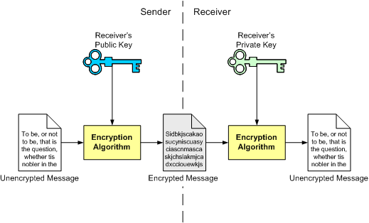
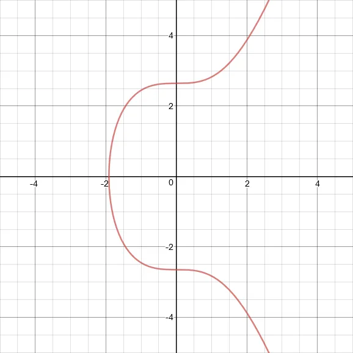
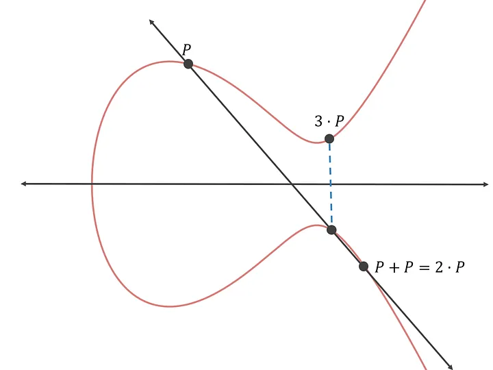
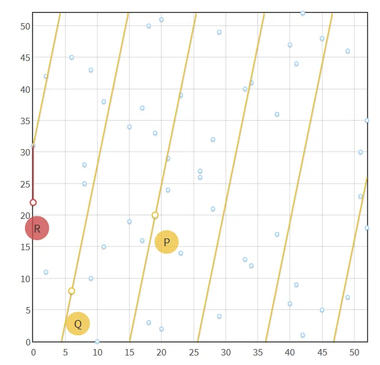

# Cryptography

<h4> Keys and addresses</h4>

> Ownership of ether by EOAs is established with digital private keys, an Ethereum address and digital signatures. 

- The private key is one of the most important concepts of cryptography in ethereum. The private key can also be used to derive an Ethereum address -> an account.

> Private keys are not directly used in the Ethereum system in any way. They are never transmitted or stored. They shouldn't appear in messages nor should they be passed around in the network.

> Access and control of funds is done with digital signatures. The digital signatures are created using the private key.

<h4> Public Key Cryptography and Cryptocurrency</h4>

> Public key cryptography relies on special mathematical functions that have a specific property: they are easy to calculate, but hard to reverse-engineer

> One of the advanced category of mathematical functions that Ethereum uses is based on artithmetic operations on an elliptic curve

- The elliptic curve used by Ethereum is called secp256k1 curve
- The equation for the curve is y^2 = x^3 +7

In elliptic curves, adding two points results in a third new point (that intersects the curve). After getting that third point, it is then reflected across the x axis. 

> In order for it to be even more secure, a starting point P is added to itself to receive a new point, which is then reflected:

> Doing the above step 10 times can be calculated in four addition operations.
>
> P+P = 2•P
>
> 2•P+2•P = 4•P
>
> 4•P+4•P = 8•P
>
> 2•P+8•P=10•P

How many steps would it take to compute x•P, where x is a random 256-bit integer? In this case, x can range anywhere from 0 to 1.1579209e+77

> Computing P would never require more than 510 point addition operations

> There is no known algorithm or computer that could calculate this. Even if the calculations are started in the middle of the operations, on average it would still take about 2^128 point addition operations.

The problem with the above shown elliptic curve is that some of the coordinates might end up being too large to be stored in a standard 512-bit public key.

> y² = x³+ax+b

is transformed to

> y² mod p = (x³ + ax + b) mod p.

> X=x•P, where x is a random 256-bit integer, how can you prove to someone that you know the x that corresponds to X without revealing any useful information about x?

We can use the point addition property for the modified equation: 

> hash(m, r•P)•n•P+r•P = (hash(m, r•P)*n+r)•P

After simplifying to hash(m, R)•X+R = s•P, we are left with the fact that if you can provide an m, R and s that satisfy the above equation, then this proves that you know the x corresponding to the X in x.P = X equation.

<h5> Digital signatures </h5>

A specific message can be made so that it is required for the verification to be succesful. We can use the m, R and s to form a digital signature for that message. Usually, the message is the unsigned part of a transaction. Generally, the digital signature for a transaction is the x-coordinate of R concatenated with s.
