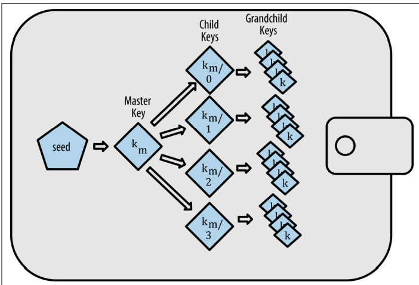

# Chapter 5 - Wallets

Ethereum wallets usually refer to a piece of software that serves as a user interface and manages keys and addresses. Furthermore, it also makes the interaction with contracts possbile (such as the ERC-20 tokens).

> A common misconception is that wallets directly store funds of users. This is incorrect as wallets are more like a keychain that holds all of the keys. The actual funds are recorded directly onto the blockchain.

> The most convenient wallet system in Ethereum would utilize one key for every transaction. This is not at all ideal, because then every transaction you make would be able to be tracked back to you.

Another common misconception is the following example:

In traditional banking, whenever you decide to move funds from one place to another, you request for the bank to do so and no one but you and the bank knows that this transaction has been made. You also expect the bank to do that movement .

> In blockchain, everyone can see the transaction that you are making. Ontop of that, everyone must validate that it is indeed a transaction you want to make and its authenticity.

There are two types of wallets in Ethereum: deterministic and nondeterministic.

> Nondeterministic wallets (also refered as JBOK or just a bunch of keys) always generate a new random private key from a random number generator

> Deterministic wallets generate a private key based on a seed. This seed is usually either a set of words/characters. To prevent security measures such as losing/forgetting the seed, most applications that utilize this method tend to make you write it down and keep it somewhere safe.

> It is good practice to not re-use addresses, because then it becomes apparent and can be tracked down to a specific entitiy person. It can even go as far as using a new address for every transaction, but that can get expensive, especially if dealing with a lot of tokens or funds. 

- Nonderministic wallets are also a nightmare to manage since as new, completely random and different keys are generated, more and more backups must be made which leads to potential security outbreaks or the loss of keys/data.

Nonetheless, it is common to see a keystore file (encrypted by a passphrase) in most ethereum clients which contain the following properties:

> {
>  "address": "001d3f1ef827552ae1114027bd3ecf1f086ba0f9",
>  "crypto": {
>  "cipher": "aes-128-ctr",
>  "ciphertext":
>  "233a9f4d236ed0c13394b504b6da5df02587c8bf1ad8946f6f2b58f055507ece",
>  "cipherparams": {
>  "iv": "d10c6ec5bae81b6cb9144de81037fa15"
>  },
>  "kdf": "scrypt",
>  "kdfparams": {
>  "dklen": 32,
>  "n": 262144,
>  "p": 1,
>  "r": 8,
>  "salt":
>  "99d37a47c7c9429c66976f643f386a61b78b97f3246adca89abe4245d2788407"
>  },
>  "mac": "594c8df1c8ee0ded8255a50caf07e8c12061fd859f4b7c76ab704b17c957e842"
>  },
>  "id": "4fcb2ba4-ccdb-424f-89d5-26cce304bf9c",
>  "version": 3
> }

This keystore format uses a key derivation function (KDF) or a password stretch algorithm which protects against bruteforce, dictionary and rainbow table attacks.

<h5> Seeded wallets

Seeded wallets are the type of wallets that use a single "seed" to generate all of the private keys. In case that the seed is obtained by an attacked, all of the keys derived from that seed can be reproduced and all of the funds in the given account can be stolen. The most common and used deterministic seed wallets are the HD ones (hierarchical
deterministic) by the BIP-32 standard. 

> The way that BIP-32 HD wallets work is the following:

- A seed is the root node of the strucutre
- The seed is followed by a master key
- Other private keys can be derived from that master key, called child keys
- From child keys, grandchild keys can be derived and so on

HD (Hierarchy deterministic) wallets have some key advantages over normal deterministic wallets. 

- Specific keys can be traced back and can have organizational meaning: specific sub-branch is for one company payments, another branch for a different company, etc.

>  Using mnemonic codes in Ethereum clients is commonly seen. This usually means a set of words that are easy to remember and easy to write down. 
>
> wolf juice proud gown wool unfair
> wall cliff insect more detail hub
>
> The hex version of a seed is very difficult to write down, which leads to security measures or making a mistake. Furthermore, when a mistake is made by writing down the sequence of mnemonic words - insect is switched with inzect for example, we can easily derive where the mistake comes from. After closer examination, we clearly see that inzect has been mispelled.

> Mnemonic codes have an optional passphrase which can be added to the generation of words.
