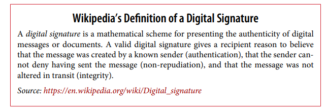
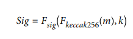
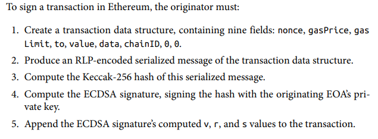

# Chapter 6 - Transactions

> Transactions are signed messages that originate from an EOA (Externally owned account) and are recorded on the Ethereum blockchain.

> ❗ Everything in Ethereum is started (initiated) by a transaction. Ethereum is not autonomous, every transaction represents a state change in the Ethereum blockchain. It can be compared like every "tick" of a handwatch's handles. Transactions are what move the Ethereum ecosystem.

A transaction on the Ethereum blockchain consists of:

- Nonce

  > A sequence number that is used to prevent message replay
  >
- Gas price

  > The price of gas (in wei) that a originator (sender) is willing to pay
  >
- Gas Limit

  > The amount of gas that an originator is willing to buy for this transaction
  >
- Recipient

  > The destination address of a transaction
  >
- Data

  > The data of a transaction, variable length binary data payload
  >
- v, r, s

  > The three components of an ECDSA digital signature from the originating EOA
  >

> ❗ The transaction's message is serialized using RLP (Ethereum's encoding scheme for creating simple, byte-perfect data serialization)

As it may be noticed, the data payload does not contain a field like "from" to map to the sender. This is because the public key of the EOA originator can be derived from the digital signature (v, r, s). Furthermore, taking the last 20 characters of the hash of the public key gives us the address of the EOA originator.

<h4> The transaction nonce

The nonce in Ethereum transactions is commonly overlooked. As defined in the Yellow papers of Ethereum,

> ❗ A transaction nonce represents a scalar value that is equal to the number of transactions (valid) made from this address. In the case of an account associated with code, the number of contract-creations that have been made.

The nonce value in a transaction is extremely important, as it prevents multiple security and validation errors.

- The transaction nonce is not stored anywhere on the blockchain. Instead, it is calculated dynamically.

> ❗ As mentioned in the book, imagine that you have two payments to make. One of those transactions is one of 8 ether and is very important and the other - 6 ether, but with less importance. You make both of the transactions, but you realize later that you do not have enough Ethereum.
>
> This means that one of the transactions you made will fail. Had the nonce value not existed, the only way that it would be determined which transaction gets made first would be whichever one reaches a Node first and gets validated first.

> However, with the nonce value, the first transaction you make gets assigned a nonce value of 3 (example) and the second one - a value of 4. Now when the transaction reaches a certain Node, it knows what transaction to execute first because of the assigned nonce value.

> Another problematic example is if you have 100 ether and you make a transaction of 2 ether. Had the nonce not been included in the transaction data, everyone on the blockchain could "repeat" the transaction, draining the entirety of ether on the account.

<h5> Keeping track of nonces

> A nonce basically represents the number of transactions or contract deployments (creations) that have been made. Usually, wallets are left with the task to keep track of how many transactions have been made.

<h4> Gaps in nonces, duplicate nonces and confirmation of transactions

> ❗ A nonce gap is can be explained with the following example: you create your very first EOA (externally owned account) and decide to send 5 ether to your friend. Your initial transaction nonce (transaction count) would be 0. You decide to send 5 ether once again right away, but this time something happens and your nonce gets a value of 2 assigned to it. There is now a "gap" between the two nonces, which blocks your second transaction of executing. Once you make a transaction with a nonce of 1, however, the two transactions get executed after being validated.

> ❗ Duplicated nonces in a transaction is just as problematic. What happens when a transaction nonce is duplicated is that whatever transaction reaches a node first and gets validated is the one that will be executed. The other transaction  will be rejected. This process is fairly random.

<h4> Concurrency problems

> Concurrency means the execution of something without a particular order without affecting the outcome.

Concurrency problems can occur in many parts of the Ethereum ecosystem. One of which is the processing/making transactions. Many wallet applications can make the same transaction which would lead to a problem. One approach would be to queue all of the transactions to a singular node without giving them a nonce, but then that could create a bottleneck as they would queue up and overflow.

<h4> Transaction gas

Transaction gas is a seperate from ether virual currency that is the amount that an account is willing to pay for the execution of a given transaction.

> ❗ The higher the gas price, the faster the transaction should be executed. Conversely, lower priority transactions can carry a lower gas price, resulting in slower confirmation. During in very low demands for space in a block, a transaction of a gas price of 0 is possible to be executed.

> For simple transactions that just tranfer ether from one EOA to another EOA the gas units needed is set at 21,000. To calculate how much that will cost, you simply have to multiply the gas price by the number of units.

> ❗ In the case of a contract destination address, the gas amount needed can't be estimated correctly.
>
> Imagine the following scenario: You send the two requests to a lotery contract. The first transaction doesn't trigger any winnings and no functionality is needed to be calculated. The same exact second transaction, however, triggers a win and the prize needs to be calculated. This second transaction will now cost more than the first.

> Quoted from the book: "To borrow a common analogy used in Ethereum, you can think of gasLimit as the
> capacity of the fuel tank in your car (your car is the transaction). You fill the tank
> with as much gas as you think it will need for the journey (the computation needed to
> validate your transaction). You can estimate the amount to some degree, but there
> might be unexpected changes to your journey, such as a diversion (a more complex
> execution path), that increase fuel consumption"

<h4> Transaction recipient

A transaction recipient is a 20-byte address. This can be an EOA or a contract address.

> ❗ Ethereum does not do any address validation. Any 20 bytes can represent an address. This, however, can be potentially dangerous as if you send funds to an address that you do not have the private key to (or no one does), you "burn" the ether that you sent to that address.
>
> - Burning ether means rendering it useless. Destroying ether, never to be used again.

<h4> Transaction value and data

> The main payload of a transaction consists of two fields:
>
> - Data
> - Value

> ❗ A transaction with no data but with value is a payment.
>
> ❗ A transaction with data but without value is an invocation.
>
> ❗ A transaction without both of those fields is still possible, but is probably a waste of gas.

<h5> Transmitting value to EOA and contracts

When a transaction is made with value included with it, it does not matter whether its destination address is an EOA or an address.

> ❗ The ethereum blockchain does not flag whether an address belongs to a contract or to an EOA. Ethereum records a state change, adding the value to the address. In case that the destination address is a contract, the Ethereum EVM will attempt to call the function named in the data payload of your transaction.
>
> ❗ In case there is no data in your transaction (and the address was a contract one), Ethereum will try to execute a so called fallback function in the contract. Given that the fallback function is marked as payable, it will determine what happens next.

- In case that a fallback function is missing, the transaction will essentially increase the balance of the contract, like a payment to a wallet.

<h4> Transmitting data payload to an EOA or Contract

> When an ethereum contract contains data, it usually means that it was meant for a contract. This does not mean that it can't be sent to an EOA, thats totally valid by the Ethereum protocol. However, if nothing is done with that data, Ethereum will simply ignore it and it will not record it as a state change.

> ❗❗ The data inside an Ethereum transaction is interpreted by the EVM as a function invocation. This usually means calling the external function in a smart contract and passing in any required parameters by that function.

> The data payload sent to a contract is the following:
>
> - A function selector
>   The first 4 bytes of the Keccak-256 hash of the function’s prototype. This allows
>   the contract to unambiguously identify which function you wish to invoke.
> - The function arguments
>   The function’s arguments, encoded according to the rules for the various elemen‐
>   tary types defined in the ABI specification

<h4> Special transaction: Contract creation

> ❗ To create a contract, a contract transaction is made to the 0th address (0x0). Any value sent to this address is lost (burned) forever. Sometimes, people send ether to this address to intentionally burn ether, but there is a specially dedicated address for that:
>
> 0x000000000000000000000000000000000000dEaD

> The contract creation datapayload for the transaction is simply the compiled bytecode which will create the contract.

<h3> Digital signatures in transactions

> ❗ In Ethereum, the digital signature algorithm is the ECDSA mentioned in the previous chapter summaries.

> ❗ A digital signature has 3 purposes:
>
> 1) A digital signature proves that the owner of a private key has authorized the spending of ether or execution of a contract
> 2) Non-repudiation: the proof of authorization is undeniable
> 3) The digital signature makes sure that the data has not been and cannot be modified by anyone after the transaction is signed.

> A  digital signature is a mathematical scheme that consists of two parts.
>
> 1) The first part is taking a digital signature algorithm and the message of a signature (+ private key of the originator). More accurately, taking the keccak256 hash of the RLP encoded data from the transaction and signing it with the following equation:
>
>    
>
>    Where:
>    • k is the signing private key.
>    • m is the RLP-encoded transaction.
>    • Fkeccak256 is the Keccak-256 hash function.
>    • Fsig is the signing algorithm.
>    • Sig is the resulting signature.
>
>    Usually, it is only referred as Sig = (r,s)
> 2) Verifying the Signature
>    To verify the signature, one must have the signature (r and s), the serialized transac‐
>    tion, and the public key that corresponds to the private key used to create the signa‐
>    ture. Essentially, verification of a signature means “only the owner of the private key
>    that generated this public key could have produced this signature on this transaction.”
>    The signature verification algorithm takes the message (i.e., a hash of the transaction
>    for our usage), the signer’s public key, and the signature (r and s values), and returns
>    true if the signature is valid for this message and public key.

<h4> Raw transaction creation

EIP-155 makes it impossible for a trans‐
action to be replayed on another chain, because the signature’s validity depends on
the chain identifier

> [EIPs/eip-155.md at master · ethereum/EIPs · GitHub](https://github.com/ethereum/EIPs/blob/master/EIPS/eip-155.md)

<h4> Separating Signing and Transmission (Offline Signing)

Typically, people would think that creating the data structure and data payload for a transaction, signing it and trasmitting it is done in one step. This can be done, however, it would be more secure to create a transaction in two steps.

> First, in an offline environment, sign the transaction.
>
> Second, trasmit the transaction from another computer connected to the internet.

- Why? The computer that has the ability to sign transactions means it has the private keys on its memory. Given it was all done in one step, the private keys could potentially be exposed to

<h4> Transaction propagation

> A node in the Ethereum blockchain is refered to a client connected to the P2P network. This ideally forms a mesh network. No node is special, they all act as peers.

> ❗❗ How does a transaction get verified by other nodes.
>
> Transaction propagation starts with the originator node creating (or receiving) a signed transaction. The transaction is validated and then sent to all of the peers (up to 13 other nodes) called neightbours. Each neighbour verifies that transaction and then sends it to its 13 neighbours

This creates the so called "flood routing" which makes sure that within seconds, the transaction is propagated to all of the Ethereum nodes around the globe.

> The neighbor that sent it to the node may be the
> originator of the transaction or may have received it from one of its neighbors. To be
> able to track the origins of transactions, or interfere with propagation, an attacker
> would have to control a significant percentage of all nodes. This is part of the security
> and privacy design of P2P networks, especially as applied to blockchain networks. (or the so called 51% attack)

<h4> Recording on the blockchain

Valid transactions are eventually included in a block of transactions and thus - recorded to the Ethereum blockchain. Transactions also modify the state of the Ethereum singleton, either by adding to a balance of an account or by invoking some functionality of a contract.

> Such changes are kept in the form of a transaction receipt, as well as any events that may come together with it.

> Important note:
>
> tx.origin != msg.sender
>
> The transaction origin(tx.origin) is the EOA that initiated the transaction.
>
> The msg.sender can be any contract/EOA that invoked the function
