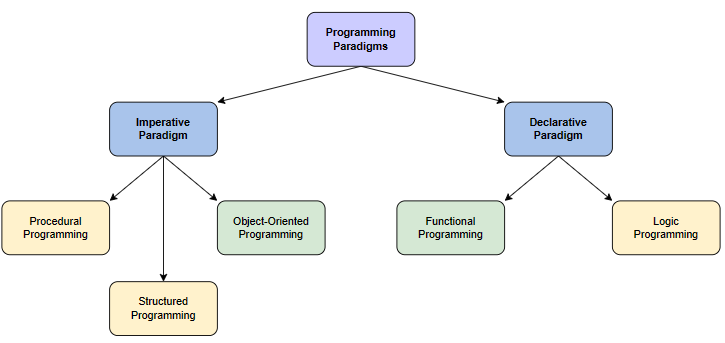
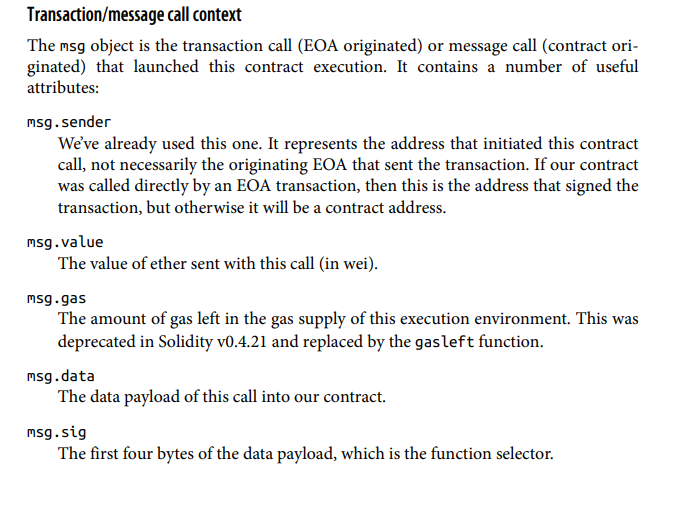
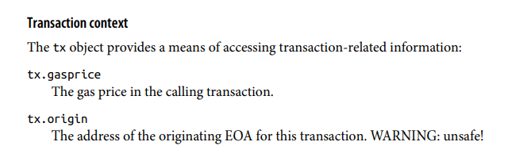
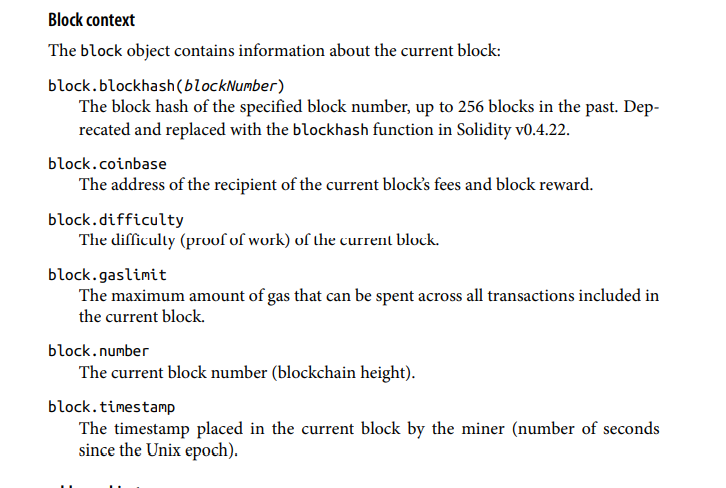
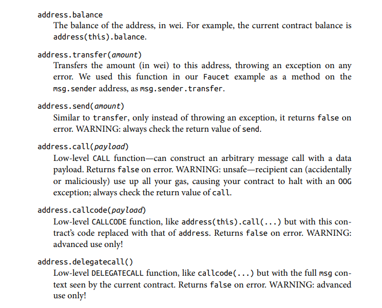
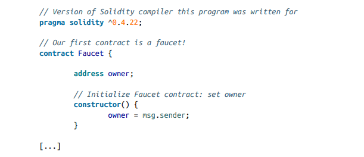
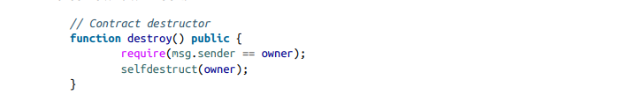
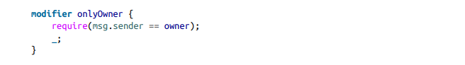

# Chapter 7 - Smart Contracts & Solidity

> What are smart contracts? 
>
> To start, we go back to what EOA's are: client owned accounts that have an ether pool stored behind a private key. Smart contracts (or contract accounts) on the other hand do not have private keys and they "own" themselves.
>
> Smart contracts can also hold code and can execute functionality triggered by transactions. 
>
> Both type of accounts(contract and EOA's) have one thing in common - an address associated with them.

> What are smart contracts?
>
> - Computer programs: They are a piece of software that holds a certain functionality behind them. They are not legal documents, nor are they "smart".
> - Deterministic: Once created and deployed onto the blockchain, the functionality of a smart contract is pre-defined. This means that the outcome of a smart contract will be the same for everyone else, given that they execute it with the same context.
> - Immutable: Once deployed onto the Ethereum blockchain, a smart contract cannot be changed. Unlike normal software programs, a new instance of a smart contract must be deployed.
> - EVM context: smart contracts can execute based on a very limited execution context. They can access the transaction sender details, their own state and some information about the most recent blockss
> - Decentralized world computer: The EVN runs locally on every Ethereum node, but because all of the nodes operate under the same states and are always in sync, Ethereum operates as a single "world computer".

<h4> Lifecycle of a smart contract

> Smart contract lifecycle begins with the creation of one at the 0x0 address. 
>
> - The address of a smart contract is derived by the contract creation transaction as a function of the originating account and nonce.
> - The address of a smart contract can be used as a recipient, sending funds and executing functions
> - Smart contracts don't have keys

Smart contracts do not run autonomously or in the background. Their execution is always triggered by an incoming transaction. This means that they lie dormant until a transaction triggers one of their functionality.

> Smart contracts are not owned by anyone. This has to be specifically programmed inside a smart contract to specify that a specific address should be the owner of that contract.

- Smart contract execution is in no way parallel: the Ethereum computer should be considered a single-threaded machine.

> Transactions are atomic. This means that they execute one at a time and are only marked as succesful if a the functionality that is being execute terminates succesfully. The transaction is then recorded and is immutable.
>
> If execution fails due to an error, the functionality is "rolled back" and any state changes are removed. The transaction is still recorded as an attempt and the gas fees is taken from the originating account.

Smart contracts can't be changed. This, however, does not mean that smart contracts cannot be deleted. 

>  In order for a smart contract to be deleted, explicit functionality must be defined that allows the ability of the so called "SELFDESTRUCT" action. If the smart contract does not have this functionality it is immutable and can't be deleted.

<h4> High level languages for smart contracts

> ❗ In smart contracts, bugs literally cost money. This means that it is cruical for understand smart contracts and write them without any unintended effects.

> Declarative vs imperative languages:
>
> Declarative programming: declarative programming describes what you want the program to achieve rather than how it should achieve it.
>
> Examples: SQL, Lisp, Html, Prolog, Miranda
>
>
> Imperative programming: How the program should execute, given instructions and steps
>
> Examples: C++, Java, C# `<b>Solidity</b>`

Some of the more popular languages for smart contract programming are: 

- LLL - declarative programming language, rarely used anymore
- Serpent (imperative) like Python
- Solidity (imperative) like C++ and Java,Javascript
- Vyper (imperatative) like serpent
- Bamboo(imperative), no iterative loops and explicit state transitions. More auditable, but very new

>  Solidity comes with its own ABI (application binary interface) standart, as well as its ABI

<h4> The solidity ABI

Quoted from the book:

"In computer software, an application binary interface is an interface between two pro‐
gram modules; often, between the operating system and user programs. An ABI
defines how data structures and functions are accessed in machine code; this is not to
be confused with an API, which defines this access in high-level, often humanreadable formats as source code. The ABI is thus the primary way of encoding anddecoding data into and out of machine code"

<h5> Selecting a solidity compiler and language version

The Solidity language and compiler are still in constant flux and have regular updates. Normally, this would mean that the software version changes and contracts get outdated.

> To deal with this, Solidity offers a compiler direction known as a version pragma. This instructs the compiler that the program expects a specific compiler version:
>
> "pragma solidity ^0.4.19"

> Since Solidity programs are immutable and can't be changed (except deleted) new updates do not conflict with old contracts that use an older version of the language or the compiler.

<h4> Data Types

Referenced from the book: 

Boolean (bool)
Boolean value, true or false, with logical operators ! (not), && (and), || (or), ==
(equal), and != (not equal).
Integer (int, uint)

Signed (int) and unsigned (uint) integers, declared in increments of 8 bits from
int8 to uint256. Without a size suffix, 256-bit quantities are used, to match the
word size of the EVM.

Fixed point (fixed, ufixed)
Fixed-point numbers, declared with (u)fixedMxN where M is the size in bits
(increments of 8 up to 256) and N is the number of decimals after the point (up to
18); e.g., ufixed32x2.

Address
A 20-byte Ethereum address. The address object has many helpful member
functions, the main ones being balance (returns the account balance) and
transfer (transfers ether to the account).

Byte array (fixed)
Fixed-size arrays of bytes, declared with bytes1 up to bytes32.

Byte array (dynamic)
Variable-sized arrays of bytes, declared with bytes or string.

Enum
User-defined type for enumerating discrete values: enum NAME {LABEL1, LABEL
2, ...}.

Arrays
An array of any type, either fixed or dynamic: uint32[][5] is a fixed-size array of
five dynamic arrays of unsigned integers.

Struct
User-defined data containers for grouping variables: struct NAME {TYPE1
VARIABLE1; TYPE2 VARIABLE2; ...}.

Mapping
Hash lookup tables for key ⇒ value pairs: mapping(KEY_TYPE ⇒ VALUE_TYPE)
NAME.

Additionally, solidity has two more literals that can be used for the calculation of different units:

<h4> Time units

> The units seconds, minutes, hours, and days can be used as suffixes, converting
> to multiples of the base unit seconds

<h4> Ether units

> The units wei, finney, szabo, and ether can be used as suffixes, converting to
> multiples of the base unit wei.

<h4> Predefined global variables and functions

The next couple of snippets are directly taken from the book to avoid redundancy.

<h4> Transaction / message context

<h4> Transaction context

<h4> Block context

<h4> Address object

<h4> Contract, interface and libraries

> The main data (object) type in Solidity is a contract. A contract is much like a class in other languages - it encapsulates variables and functions.

> Library is a contract that is deployed once. It is to be used with the delegatecall() using its address

> Interface - just like a regular interface, the functions inside an interface are just definitions. Whatever contract inherits from an interface, it must implements those functions

<h4> Functions in Solidity

> Fallback functions: a function that has no name or access modifier. It also can't return anything. This function is called when no other function is specified in transaction data.

<h6> Access modifiers

1) public: This function can be called by any EOA or contracts, or from within the contract.
2) private: This function can only be called from within the contract.
3) external: EOA's and contracts can call these functions. These functions can't be called from inside the contract unless the keyword "this" is specified.
4) internal: These functions can't be called by EOA's. They can be called only from within the contract. Whenever a contract inherits (derives) from a contract with internal functions, they can be called.

> ❗ Important note: all functions/code are visible on the blockchain, no matter their access modifier.

<h6> Function behaviour modifiers

1. pure: When a function is pure, it promises the Solidity compiler that it does not read nor write any of the state variables. This is encouraged to be used in a declarative way with no side effects.
2. constant/view: When a function is specified as view, it promises that it might look into the state variables, but not write
3. payable: a function that can accept incoming payments

<h6> Constructor

Like other OOP languages, Solidity has a constructor which is ran only once.

> Setting up the msg.sender address (the address who creates the contract) as the owner of the contract
>
> 

> Allowing for deletion of the contract given that the originator address is the owner: 
>
> 

Solidity also has modifiers, which are usually used to "require()" some condition. They are very useful due to the fact that they can be easily reproduced and used in multiple functions without code duplication:

